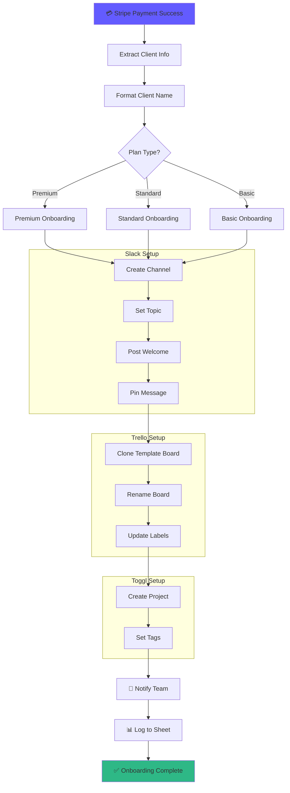
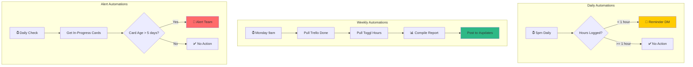
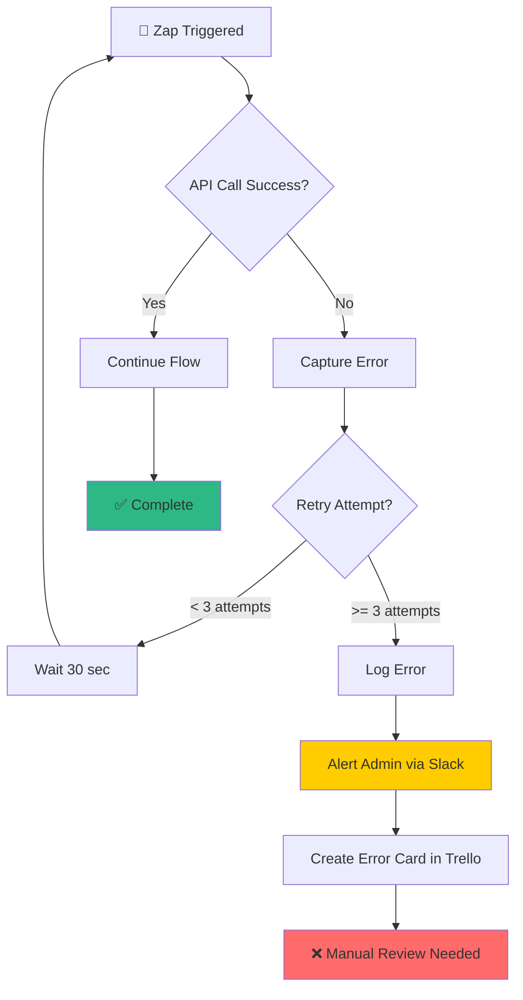

# Workflow Diagrams - AgencyFlow Automation Suite

Visual representations of all automation flows using Mermaid diagrams.

---

## 1. Slack → Trello Task Pipeline

```mermaid
flowchart TD
    A[📱 New Slack Message] --> B{Contains Keywords?}
    B -->|confirmed/approved| C[Extract Details]
    B -->|No match| X[❌ Skip]

    C --> D[Parse Title]
    C --> E[Parse Due Date]
    C --> F[Parse Labels]

    D --> G{Project Type?}
    E --> G
    F --> G

    G -->|Development| H1[🔧 Dev Board]
    G -->|Design| H2[🎨 Design Board]
    G -->|Other| H3[📋 General Board]

    H1 --> I[Create Trello Card]
    H2 --> I
    H3 --> I

    I --> J[Apply Labels]
    J --> K[Set Due Date]
    K --> L[✅ Send Slack Confirmation]

    style A fill:#4A154B
    style L fill:#2eb886
    style X fill:#ff6b6b
```

---

## 2. Stripe → Client Onboarding Flow

---

## 3. Bi-Directional Trello ↔ Slack Sync

```mermaid
flowchart LR
    subgraph Slack
        SL1[New Message]
        SL2[Notification]
    end

    subgraph Trello
        TR1[Create Card]
        TR2[Card Moved]
        TR3[Card Updated]
    end

    SL1 -->|Task confirmed| TR1
    TR2 -->|Status change| SL2
    TR3 -->|Due date/comment| SL2

    style SL1 fill:#4A154B
    style SL2 fill:#4A154B
    style TR1 fill:#0079bf
    style TR2 fill:#0079bf
    style TR3 fill:#0079bf
```

---

## 4. Admin Automation Hub

---

## 5. Complete System Overview

```mermaid
flowchart TD
    subgraph External
        ST[💳 Stripe]
        CL[👤 Client]
    end

    subgraph Core Platforms
        SL[📱 Slack]
        TR[📋 Trello]
        TG[⏱️ Toggl]
    end

    subgraph Automation Layer
        ZP[⚡ Zapier]
    end

    subgraph Logging
        GS[📊 Google Sheets]
    end

    CL -->|Payment| ST
    ST -->|Webhook| ZP

    ZP -->|Create Channel| SL
    ZP -->|Clone Board| TR
    ZP -->|Create Project| TG
    ZP -->|Log Event| GS

    SL <-->|Task Sync| ZP
    TR <-->|Updates| ZP
    TG -->|Reports| ZP

    ZP -->|Notifications| SL

    style ZP fill:#ff4a00
    style SL fill:#4A154B
    style TR fill:#0079bf
    style TG fill:#E57CD8
    style ST fill:#635bff
```

---

## 6. Error Handling Flow

---

## Diagram Legend

| Symbol | Meaning           |
| ------ | ----------------- |
| 📱     | Slack             |
| 📋     | Trello            |
| ⏱️     | Toggl             |
| 💳     | Stripe            |
| ⚡     | Zapier/Automation |
| ✅     | Success/Complete  |
| ❌     | Error/Skip        |
| 🚨     | Alert             |
| 📊     | Reporting/Logging |

---

_These diagrams can be rendered using any Mermaid-compatible viewer (GitHub, Notion, VS Code extension)._
