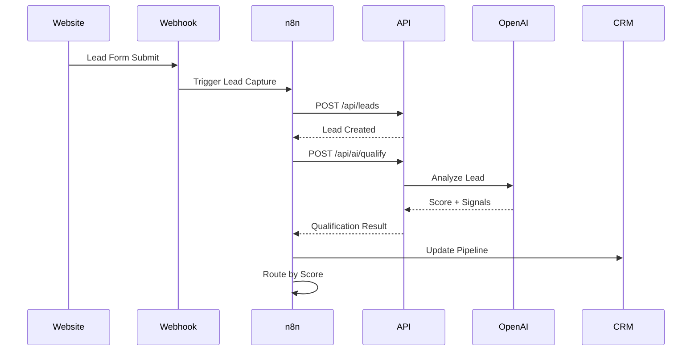

# Architecture Documentation

## System Overview

The AutoScale CRM Intelligence Hub is a production-ready automation system built on n8n, demonstrating enterprise-grade workflow orchestration with AI-powered lead qualification.

## Architecture Diagram

```mermaid
flowchart TB
    subgraph External["External Sources"]
        WEB[🌐 Website Forms]
        ADS[📢 Ad Platforms]
        EMAIL[📧 Email Events]
    end

    subgraph Gateway["API Gateway Layer"]
        WEBHOOKS[Webhook Endpoints]
        REST[REST API]
    end

    subgraph N8N["n8n Workflow Engine"]
        W1[01 Lead Capture]
        W2[02 AI Qualification]
        W3[03 CRM Sync]
        W4[04 Marketing]
        W5[05 Onboarding]
        W6[06 Monitoring]
    end

    subgraph API["Node.js API Service"]
        LEADS[/api/leads]
        AI[/api/ai]
        WH[/api/webhooks]
    end

    subgraph AI_Engine["AI Processing"]
        OPENAI[OpenAI GPT-4]
        FALLBACK[Rule-Based Fallback]
    end

    subgraph Storage["Data Layer"]
        PG[(PostgreSQL)]
        REDIS[(Redis Cache)]
    end

    subgraph Outputs["Business Outputs"]
        CRM[CRM Updates]
        EMAILS[Email Sequences]
        ALERTS[Team Alerts]
        TASKS[Task Creation]
    end

    WEB --> WEBHOOKS
    ADS --> WEBHOOKS
    EMAIL --> WEBHOOKS

    WEBHOOKS --> W1
    W1 --> W2
    W2 --> AI
    AI --> OPENAI
    AI --> FALLBACK
    W2 --> W3
    W3 --> W4
    W3 --> W5
    W1 --> W6
    W2 --> W6
    W3 --> W6

    LEADS --> PG
    AI --> REDIS
    W3 --> CRM
    W4 --> EMAILS
    W5 --> TASKS
    W6 --> ALERTS
```

## Component Details

### 1. Workflow Engine (n8n)

| Workflow            | Purpose                 | Triggers           |
| ------------------- | ----------------------- | ------------------ |
| 01-lead-capture     | Ingest & validate leads | Webhook            |
| 02-ai-qualification | Score leads with AI     | Internal           |
| 03-crm-sync         | Pipeline management     | Schedule + Webhook |
| 04-marketing        | Engagement tracking     | Schedule + Webhook |
| 05-onboarding       | Customer activation     | Webhook            |
| 06-error-monitoring | System health           | Schedule + Error   |

### 2. API Service (Node.js)

```
api/
├── server.js           # Express app with middleware
├── routes/
│   ├── leads.js        # Lead CRUD operations
│   ├── webhooks.js     # Event ingestion
│   └── ai.js           # AI processing endpoints
└── middleware/
    └── logger.js       # Winston structured logging
```

### 3. Data Flow



## Design Decisions

### Why This Architecture?

1. **Separation of Concerns**: n8n handles orchestration, API handles data, AI handles intelligence
2. **Resilience**: Fallback scoring when AI is unavailable
3. **Scalability**: Docker Compose allows horizontal scaling
4. **Observability**: Structured logging and monitoring workflow

### Error Handling Strategy

- **Retry with backoff** for transient failures
- **Dead letter** pattern for persistent failures
- **Health monitoring** every 15 minutes
- **Daily digest** for ops review

### Security Considerations

- Webhook secret validation
- Helmet.js security headers
- Non-root Docker containers
- Environment variable configuration

## Deployment

### Prerequisites

- Docker & Docker Compose
- OpenAI API key (optional, has fallback)

### Quick Start

```bash
cp .env.example .env
# Edit .env with your values
docker-compose up -d
```

### Verify Deployment

```bash
# Check services
docker-compose ps

# Test API
curl http://localhost:3000/health

# Access n8n
open http://localhost:5678
```

## Testing

```bash
cd tests
npm install
npm test
```

## Monitoring

The system includes built-in monitoring via workflow 06:

- **Health checks** every 15 minutes
- **Error alerting** on workflow failures
- **Daily digest** at 9 AM UTC
